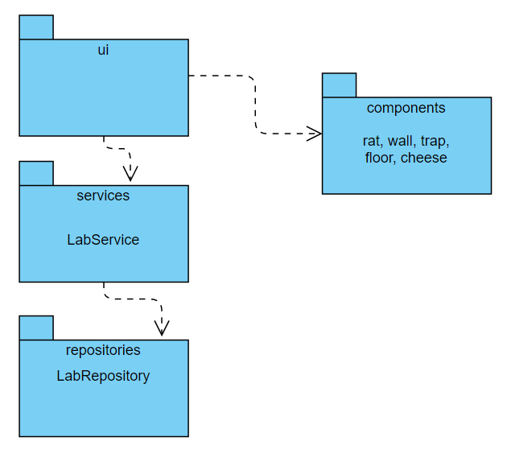

Ohjelman alustava rakenne pakkauskaaviona on seuraava. Rakenne on toteutettu tässä vaiheessa pakkauksien ui ja components osalta. Yhteys tietokantaan toteutetaan seuraavaan palautukseen.

Seuraava sekvenssikaavio kuvaa tilannetta, jossa LabRat-peli on käynnissä ja pelaaja painaa kerran vasenta nuolinäppäintä. Siirto vie rotan loukkuun ja pelaajalle näytetään Game Over -valikko.

