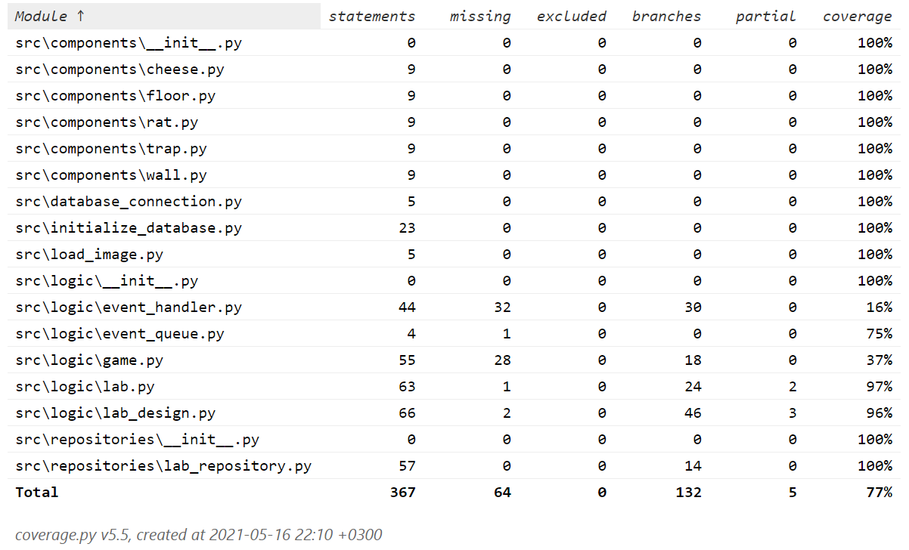

# Testausdokumentti

Ohjelmaa on testattu automaattisilla yksikkötesteillä ja integraatiotesteillä unittestilla. Ohjelmaa on myös testailu manuaalisesti ohjelmistokehityksen aikana.

## Yksikkö- ja integraatiotestaus

### Sovelluslogiikka

Sovelluslogiikan luokkia Lab, Game, ja LabDesign testataan luokilla TestLab, TestGame ja TestLabDesign. Pelin käynnistyessä tietokanta alustetaan viidellä labralla. TestLab-luokkassa näitä käytetään yhdessä kahden kovakoodatun lab_map-kartan kanssa testien vertailujen toteuttamiseksi.

Pelin omaa tietokantaa käytetään myös TestLabDesign-luokan testeissä. Luokan LabDesign on tarkoitus hoitaa käyttäjän syöttämiä virheellisesti syötteitä, joten virheellisiä syötteitä testataan luokassa TestLabDesign.

Luokalla TestGame on huonoin testikattavuus, koska en ehtinyt kirjoittamaan useampia testejä. Luokka testaa luokan Game alkuasetelman totuusarvoja, joita käytetään navigoimaan eri näkymien välillä.

### Komponentit

Pelin komponentit ovat Floor, Wall, Trap, Cheese ja Rat. Luokkien automaattinen testaus toteutuu luokan TestLab kautta, koska luokka Lab vaatii toimiakseen komponenttiluokkia. Luokkaan TestLab on kirjoitettu tarkoituksenmukaisesti testejä komponenttiluokkien testaamiseksi.

### Repositoriot

Repositorioluokka LabRepository hoitaa labrojen tallettamisen tietokantaan. Sitä testataan luokalla TestLabRepository, missä tarkistetaan, että tietokantaan tallettaminen onnistuu. Luokassa ei ole testattu virheellisten syötteiden varalta, koska luokan LabDesign on tarkoitus hoitaa käyttäjän virheelliset syötteet.

### Testauskattavuus

Käyttöliittymäkerrosta lukuunottamatta sovelluksen testauksen haarautumakattavuus on 77%

Testaamatta jäivät luokat EventHandler ja EventQueue. Myös Game -luokan testaus jäi vähille.

## Järjestelmätestaus

Sovelluksen järjestelmätestaus on suoritettu manuaalisesti. Sovellus on haettu ja sitä on testattu ympäristöissä Windows 10 ja Linux.

### Toiminnallisuus

Suurin osa [määrittelydokumentin](https://github.com/saaruuna/ot-harjoitustyo/blob/master/dokumentaatio/vaatimusmaarittely.md) toiminnallisuuksista on testattu. Virheellisiä syötteitä on pyritty kokeilemaan monipuolisesti manuaalisesti sekä automaattisesti.

## Sovellukseen jääneet laatuongelmat

Tietokanta alustetaan uusiksi joka kerta, kun sovellus käynnistetään, joten labyrinttien pysyväistallennuksessa on jäänyt kehittämisen varaa.
