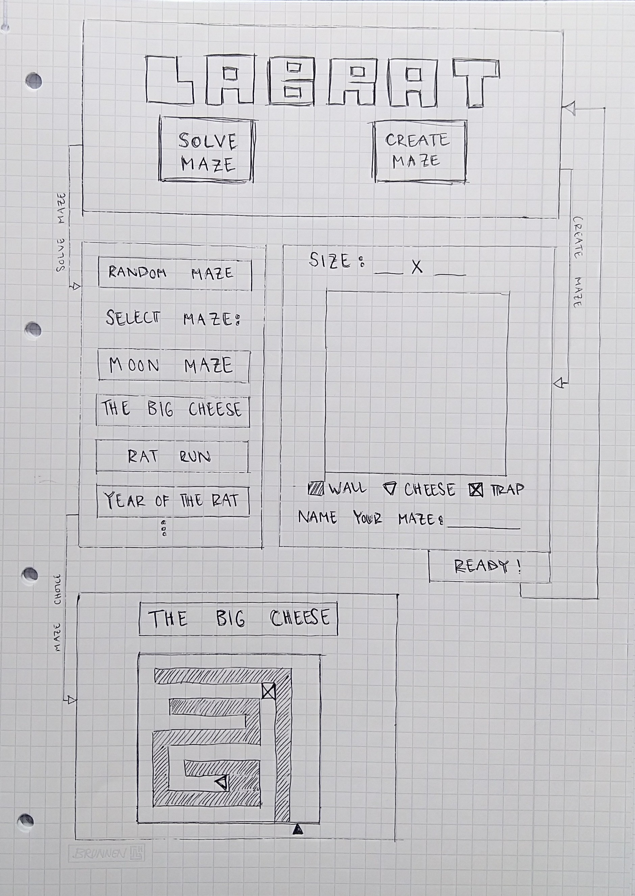

# Vaatimusmäärittely

## Toiminnallisuudet

Viikolla 5 lisätty:
* Main Menu -valikko
* Game Over -valikko
* navigointi Main Menu -valikosta peliin, pelistä Game Over -valikkoon ja takaisin alkuun
* (ei näy käyttäjälle) labyrinttitietokannan alustus

## Sovelluksen tarkoitus

Sovellus on 2D- peli nimeltä LabRat. Pelihahmo on rotta, jota ohjataan labyrintin sisällä olevaa juustoa kohti. Pelin voittaa, kun rotta saa juuston. Pelin häviää, jos astuu rotanloukkuun. Pelaajan on mahdollista selvittää labyrinttejä. Tämän lisäksi pelaaja voi luoda ja tallentaa labyrinttejä tietokantaan muiden pelaajien selvitettäväksi.
mPelissä on seuraavat objektit:
* Rotta
* Seinä
* Lattia
* Juusto
* Loukku

## Käyttäjät

Sovelluksessa ei ole kirjautumismahdollisuutta. Labyrinttejä luodaan ja selvitetään kirjautumatta.

## Käyttöliittymäluonnos

## Käyttökokemus

Sovelluksessa tulisi olla helppo navigoida eri näkymien välillä. Sovelluksen kieli on englanti.

## Jatkokehitysideat

* tutorial -vaihtoehto alkunäkymään
* monipuolisempia labyrinttejä (esimerkiksi pyöröovet, liikuteltavat laatikot...)
* mahdollisuus käyttäjän luomiseen ja selvitettyjen labyrinttien tarkastelemiseen
* ajastetut pelit
* labyrintteihin jako vaikeustasoihin
* scoreboard
* satunnaisesti generoidut labyrintit
